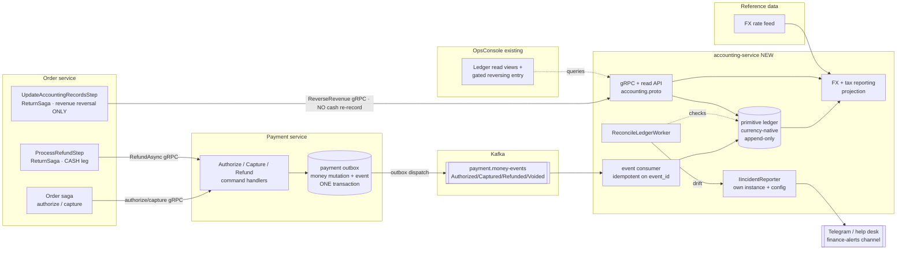

# Double-Entry Ledger — Implementation Plan

**Status:** Phase 0 + Phase 1 complete (2026-08-15) — Phase 2 ready to start
**Owner:** _TBD_
**Created:** 2026-08-03
**Approach:** A dedicated `accounting-service` (own Postgres + outbox) is fed by **atomic outbox money-events** emitted by Payment. It keeps a currency-native primitive double-entry ledger and a separate FX/tax **reporting** layer. Chosen because the Order return saga, the `accounting.proto` contract, the `AccountingGateway`, and the `AccountingUrl` config already assume this service exists — and because multi-currency + tax are on the roadmap, which is a real bounded context that must not live inside Payment's write DB.
**Related:** [DEEP_SYSTEM_REVIEW.md](DEEP_SYSTEM_REVIEW.md) §5.3 / §9.3, [ORDER_PAYMENT_FINTECH_FLOW.md](ORDER_PAYMENT_FINTECH_FLOW.md), [POSTMORTEM_compensation_retry_double_insert.md](Order/POSTMORTEM_compensation_retry_double_insert.md)

---

## 1. Goal & non-goals

**Goal:** Give the system a single, append-only, double-entry source of monetary truth so that (a) money state is one artifact instead of a reconstruction across Payment rows + saga context + callbacks, (b) an aggregate invariant (`Σdebits = Σcredits`, ledger total = provider total) can *detect* the class of bug the entity-level reconciliation workers structurally cannot (e.g. the $4,180 double-refund from the post-mortem), (c) every cent is auditable to an order, payment, and idempotency key, and (d) multi-currency + tax reporting have a proper home.

**In scope:** standalone `accounting-service`; currency-native primitive ledger; FX conversion to a reporting currency; tax split recording; reconciliation worker; read/reporting API; an operator surface in the existing OpsConsole.

**Non-goals (for this iteration):**
- **No synchronous money-path dependency.** The saga never blocks on the ledger. Payment emits an event atomically; the ledger consumes it asynchronously.
- Not replacing the existing reconciliation/convergence workers — they stay and keep converging stuck *entities*; the ledger reconciliation verifies the *aggregate*.
- Not full GAAP period-close, statutory filing, or invoicing. Tax **amounts** are computed upstream (Order/pricing); the ledger only records the split and reports on it.

---

## 2. Design decision: standalone event-driven `accounting-service` (Option 2 / hybrid)

The ledger is a **separate bounded context**, but the fact "money moved" is captured **atomically at the source** so the ledger can never silently miss an event.

> **Core principle — atomic capture at the source, event-driven ledger downstream.**
> Payment writes the money mutation **and** an outbox event in the *same* `UnitOfWork.SaveChangesAsync` (the mechanism it already uses for `OutboundOrderCallback`). The `accounting-service` consumes that event stream and posts balanced entries. The **source of truth for "did it happen"** is the atomic outbox event; the **ledger itself is an event-sourced projection** — eventually consistent, made trustworthy by idempotent consumers + reconciliation.

This is the pattern serious payment orgs use (Stripe/Adyen/Uber-style): the money service never loses an event (atomic outbox), and the ledger is its own service with its own DB, rate feeds, and reporting.

**Why Option 2 for this system specifically:**
- The [accounting.proto](Order/Order/Protos/protos/accounting.proto), [AccountingGateway.cs](Order/Order/Infrastructure/Gateways/AccountingGateway.cs), and `AccountingUrl` in [configmap.yaml](k8s/configmap.yaml) already assume a separate service — this makes the stub real instead of deleting it.
- The Order return saga already has [UpdateAccountingRecordsStep.cs](Order/Order/Application/Sagas/ReturnSaga/Steps/UpdateAccountingRecordsStep.cs) wired for it.
- Multi-currency FX + tax need their own reference data (rate feeds, jurisdiction tables) and read models — the wrong things to bolt onto Payment's hot write DB.
- The team already runs event-driven, idempotent, outbox-based consumers, so eventual consistency — Option 2's one real cost — is cheap here.

---

## 3. Chart of accounts (currency-native + tax + FX)

Every entry is recorded in its **transaction currency**. FX conversion to the reporting currency is a *derived* layer (§5, Phase 5), never a mutation of the primitive entry.

| Account | Normal balance | Meaning |
|---|---|---|
| `customer_authorized` | debit | Holds placed, not yet captured |
| `customer_captured` | debit | Money actually taken from customer |
| `merchant_revenue` | credit | Recognized sales (net of tax) |
| `tax_payable` | credit | Tax collected, owed to authority |
| `refunds_payable` | credit | Money owed back to customers |
| `gateway_fees` | debit | Provider (Stripe) fees |
| `fx_gain_loss` | debit/credit | Realized FX difference at reporting-currency conversion |
| `chargebacks` | debit | Disputed reversals (future) |

**Invariant:** every transaction posts a balanced set of entries where `Σdebits = Σcredits`, **per currency**.

### Event → posting map

| Money event | Outbox event from Payment | Debit | Credit |
|---|---|---|---|
| Authorize | `PaymentAuthorizedEvent` | `customer_authorized` | `authorization_hold` |
| Void auth | `PaymentVoidedEvent` | `authorization_hold` | `customer_authorized` |
| Capture | `PaymentCapturedEvent` (from `PaymentSucceededEvent`) | `customer_captured` | `merchant_revenue` + `tax_payable` (+ `gateway_fees`) |
| Refund | `RefundIssuedEvent` | `refunds_payable` (+ `tax_payable` reversal) | `customer_captured` |
| Revenue reversal (return) | via Order `UpdateAccountingRecordsStep` | `merchant_revenue` | `refunds_payable` |
| Chargeback (future) | `ChargebackEvent` | `chargebacks` | `customer_captured` |

---

## 4. Architecture & data flow



**Reading the diagram:** the order saga talks to Payment exactly as today for authorize/capture. **Refund cash movement has a single owner: Payment** — `ProcessRefundStep` calls `RefundAsync`, Payment writes the mutation **and** a `Refunded` money-event in one outbox transaction, and `accounting-service` records the cash leg from that event. The return saga's `UpdateAccountingRecordsStep` posts **only the return-specific revenue reversal** (never the cash refund again), so nothing is double-booked. `ReconcileLedgerWorker` detects drift and pages through the accounting-service's **own** `IIncidentReporter` → Telegram; OpsConsole is a **pull** surface that queries the read API.

---

## 5. Data model (accounting-service Postgres)

```
processed_events                    -- consumer idempotency (Payment is at-least-once)
  event_id          text  PK        -- Kafka event id / outbox CallbackEventId
  processed_at      timestamptz

ledger_transactions
  id                uuid  PK
  transaction_ref   text  -- natural business key, e.g. "{paymentId}:capture"
  order_id          uuid  NULL
  payment_id        uuid  NULL
  ref_type          text  -- 'authorize'|'void'|'capture'|'refund'|'reversal'|'chargeback'
  ref_id            text
  currency          text  -- transaction currency
  occurred_at       timestamptz
  created_at        timestamptz
  UNIQUE (transaction_ref)          -- idempotent posting

ledger_entries
  id                uuid  PK
  transaction_id    uuid  FK -> ledger_transactions
  account           text
  direction         smallint         -- 0 = debit, 1 = credit
  amount            numeric(19,4)     -- NOT double; matches DecimalValue precision
  currency          text
  created_at        timestamptz
  INDEX (account), INDEX (transaction_id)

fx_rates                             -- effective-dated rate feed
  base_currency     text
  quote_currency    text
  rate              numeric(19,8)
  effective_from    timestamptz
  PRIMARY KEY (base_currency, quote_currency, effective_from)

ledger_reporting_entries             -- derived: entries converted to reporting currency
  entry_id          uuid  FK -> ledger_entries
  reporting_amount  numeric(19,4)
  reporting_currency text
  rate_used         numeric(19,8)
  converted_at      timestamptz
```

**Constraints / rules**
- `event_id` PK on `processed_events` → duplicate Kafka delivery is a no-op (Payment is at-least-once).
- `transaction_ref` UNIQUE → re-posting the same money event collapses to a no-op (mirrors `(PaymentId, IdempotencyKey)`).
- Append-only: no `UPDATE`/`DELETE` on ledger tables. Corrections are new balanced reversing transactions.
- `amount` is `numeric`, never `double`. Wire contracts use `common.DecimalValue`.
- The consumer validates `Σdebits = Σcredits` **per currency** before commit.
- Reporting entries are derived and rebuildable from primitive entries + `fx_rates`; they never feed back into the primitive ledger.

---

## 6. Step-by-step implementation

### Phase 0 — Bootstrap the service — **DONE (verified 2026-08-15)**
- [x] Create `Accounting/` solution mirroring existing service layout (Api / Application / Domain / Infrastructure + test projects), same conventions as Payment/Order.
- [x] Own Postgres (`accounting-postgres`), EF Core migrations (not `EnsureCreated`), health probes — see [Program.cs](Accounting/Accounting/Api/Program.cs). OTel is deferred; Payment has no OTel wiring to copy yet.
- [x] Implement the gRPC server behind the **existing** [accounting.proto](Order/Order/Protos/protos/accounting.proto) (`RecordRefund`, `ReverseRevenue`, `CancelReversal`) so the Order gateway/stub finally has a real server.
- [x] k8s manifest `accounting-service.yaml` + `accounting-postgres.yaml`; the `AccountingUrl` in [configmap.yaml](k8s/configmap.yaml) already points at it.

**Not in the original Phase 0 list, but also delivered:** `ApiKeyAuthInterceptor` (fail-closed) plus the
shared `InternalServices__AccountingApiKey` secret, and the BUG-006 fix that keys `transaction_ref`
on `return_request_id` instead of the amount.

### Phase 1 — Atomic money-events at the source (Payment) — **DONE (2026-08-15)**
This is the only change to Payment, and it reuses the outbox pattern already there.

> **Constraint found 2026-08-15:** the existing outbox is order-callback-shaped. `OutboundOrderCallback`
> requires a non-empty `OrderId`, `OrderCallbackKafkaDispatcher` maps only the four
> `OrderCallbackEventTypes` and publishes to one `KafkaOptions.SagaTopic`, and `OrderCallbackQueueService`
> also calls `payment.QueueOrderCallback`. So a **sibling** `OutboundMoneyEvent` table, queue service,
> and dispatcher write to `payment.money-events`. The saga callback rows stay untouched.
>
> **Data gap:** `Payment` stores only `Amount` (`Money`) and has no fee or tax field. `fee` and `tax`
> ship on the contract but post as zero until Payment (or upstream pricing) supplies real values.

- [x] Define money-event contracts: `PaymentAuthorizedEvent`, `PaymentVoidedEvent`, `PaymentCapturedEvent`, `RefundIssuedEvent` — see [MoneyEventTypes.cs](Payment/Payment/Application/Common/MoneyEventTypes.cs). Each payload carries `eventId`, `eventType`, `paymentId`, `orderId`, `refundId`, `providerPaymentIntentId`, `amount` (`decimal`), `currency`, `fee`, `tax`, `occurredAt`.
- [x] Write the money-event into the **same `SaveChangesAsync`** as the mutation, in `ProcessPaymentCommandHandler`, `CapturePaymentCommandHandler`, `CancelAuthorizationCommandHandler`, `RefundPaymentCommandHandler`, `HandleStripeWebhookCommandHandler` and `ReconcilePendingPaymentsCommandHandler`. No new transaction, no new failure mode.
- [x] Deterministic `event_id` (`{paymentId}:captured`, `{refundId}:refunded`, and so on) behind a UNIQUE index, so a repeated leg collapses to one outbox row.
- [x] Dispatch via a sibling `MoneyEventKafkaDispatcher` + `MoneyEventDeliveryWorker` to the `payment.money-events` topic, keyed on `payment_id` so the legs of one payment stay ordered.
- [x] Tests: capture and refund each emit exactly one money-event atomically with the mutation; a failed capture and a pending refund emit none — see [MoneyEventQueueServiceTests.cs](Payment/Payment.UnitTests/Application.Tests/Services/MoneyEventQueueServiceTests.cs).

**Emission rules.** Post `Authorized` on the transition to `Authorized`. Post `Captured` on the
transition to `Succeeded`. Post `Voided` only when a payment that was **`Authorized`** transitions to
`Failed`, because that releases a live hold. Post `Refunded` when a `Refund` transitions to `Succeeded`.

### Phase 2 — Ledger ingestion (accounting-service)
- [ ] Kafka consumer with `processed_events` idempotency (skip if `event_id` seen).
- [ ] `ILedgerPoster.PostBalancedTransaction(transaction_ref, entries[])`: validate `Σdebits = Σcredits` per currency; no-op on `transaction_ref` unique violation.
- [ ] Map each money-event to its balanced posting (§3 table), currency-native.
- [ ] Integration test: replay the same event twice → exactly one ledger transaction.

### Phase 3 — Reconciliation worker (the detection layer)
- [ ] `ReconcileLedgerWorker` asserting, per currency: `Σdebits = Σcredits`; ledger totals vs Payment/Refund row sums (via a read query or a periodic Payment snapshot event); optional vs provider settlement report.
- [ ] Give `accounting-service` its **own** `IIncidentReporter` registration reusing the existing `TelegramIncidentReporter` (lift it into `shared/`), configured with its **own** bot/chat pointed at a dedicated finance-alerts channel. On drift → `CreateInterventionTicketAsync` (Telegram); **not** a call into Order's reporter.
- [ ] SLO/alert on consumer lag.
- [ ] Test: seed a deliberate double-refund → reconciliation flags the mismatch (regression proof for the post-mortem class).

### Phase 4 — Return saga integration (make the stub real, single-owner refund)
- [ ] **Cash leg has one owner — Payment.** `ProcessRefundStep` → `RefundAsync` → Payment emits the `Refunded` money-event → `accounting-service` records the cash refund. **Drop the `RecordRefund` cash call** from `UpdateAccountingRecordsStep` — keeping it would double-book the refund against Payment's event.
- [ ] **`UpdateAccountingRecordsStep` posts only the return-specific revenue reversal** — `ReverseRevenue` (Payment can't know goods came back). `CancelReversal` posts an append-only reversing transaction (never a delete). This is safe as a synchronous gRPC call because the return saga is latency-tolerant (no hot-path head-of-line blocking).
  - _Alternative (fully event-driven):_ have Order emit a `ReturnRevenueReversal` event via its **own** outbox and let `accounting-service` consume it, making `accounting.proto` read-only. Pick this if you want one uniform pattern; the synchronous option above reuses the existing stub.
- [ ] Update [UpdateAccountingRecordsStepTests.cs](Order/Order.UnitTests/Application.Tests/Sagas/ReturnSagaSteps/UpdateAccountingRecordsStepTests.cs) to assert `RecordRefund` is **no longer** called (only `ReverseRevenue`).
- [ ] Swap the E2E `FakeGrpcAccountingGateway` for contract tests against the real service.

### Phase 5 — FX + tax reporting layer
- [ ] `fx_rates` ingestion (rate feed) + a reporting-currency setting.
- [ ] Derive `ledger_reporting_entries` from primitive entries (rebuildable projection); post `fx_gain_loss` on realized differences.
- [ ] Record the `tax_payable` split on capture from the tax amount computed upstream in Order/pricing.
- [ ] Reporting/read API (per-account balances, per-order money trail, trial balance in reporting currency).

---

## 7. How it integrates with your existing workflow

- **Order saga is unchanged on the forward path.** It keeps calling Payment over gRPC for authorize/capture/refund exactly as today. The ledger is downstream of Payment’s outbox — the saga never waits on it, so no new head-of-line blocking ([DEEP_SYSTEM_REVIEW.md](DEEP_SYSTEM_REVIEW.md) §2.3).
- **Return saga becomes real.** [UpdateAccountingRecordsStep.cs](Order/Order/Application/Sagas/ReturnSaga/Steps/UpdateAccountingRecordsStep.cs) already calls `RecordRefund`/`ReverseRevenue`/`CancelReversal`; Phase 4 gives those calls a live server. Its `CompensateAsync` maps naturally to an append-only reversing entry.
- **Payment changes are additive.** One new money-event written in the outbox transaction it already runs. If the ledger service is down, Payment is unaffected — events buffer in the outbox/topic and drain on recovery.
- **Idempotency is end-to-end.** `event_id` at the consumer + `transaction_ref` on the transaction mirror the `(PaymentId, IdempotencyKey)` discipline in §4.2, so at-least-once delivery and double-compensation both collapse to one posting.
- **Refund cash leg has exactly one owner (Payment).** The return saga records only the revenue reversal, so Payment's `Refunded` event is the sole source of the cash posting — no dual-write, no reliance on two paths agreeing on a `transaction_ref`.
- **Reconciliation is complementary.** Existing Payment/Order workers keep converging stuck entities; the ledger worker verifies the aggregate — the layer that would have caught the $4,180 incident.

### Alerting ownership
- **Detection lives in `accounting-service`** (it owns the ledger + reconciliation). **Delivery reuses the existing channel:** the service registers its **own** `IIncidentReporter` (same `TelegramIncidentReporter` code, ideally in `shared/`) with its **own** bot/chat config. It never calls Order's reporter — each service owns its outbound alerting.
- **OpsConsole is pull, not push:** it *displays* reconciliation status/drift by querying the accounting read API. The page/alert is Telegram; the dashboard is where a human looks.

---

## 8. Should the ledger have an admin console UI?

**Yes — but as read-mostly views inside the existing [OpsConsole](OpsConsole), not a new app, and never as free-form edit of an append-only ledger.**

- **Reuse OpsConsole.** It already is a .NET Minimal API + Next.js (`web/`) operator surface for saga monitoring / DLQ triage / admin mutations. Add a "Ledger" section that calls the `accounting-service` read API — no second UI stack.
- **Read views (the 90%):** per-order money trail (authorize → capture → refund → reversal), per-account balances, trial balance (transaction & reporting currency), reconciliation status + drift alerts, and a search by `order_id` / `payment_id` / `transaction_ref`.
- **Controlled write (the 10%):** the *only* mutation is "post a **manual adjusting/reversing** entry" — itself a balanced, append-only transaction, behind admin auth, requiring a reason and leaving an audit trail. **Never** edit or delete existing entries; corrections are new reversing transactions. This preserves the append-only invariant that makes the ledger trustworthy.
- **Why not a separate dedicated tool:** an accounting ledger’s value is *immutability + auditability*; a UI that can arbitrarily mutate rows destroys exactly that. Keep the surface read-heavy, and gate the one reversing-entry action.

---

## 9. Risks & mitigations

| Risk | Mitigation |
|---|---|
| At-least-once Kafka → duplicate postings | `processed_events` PK + `transaction_ref` UNIQUE → duplicates no-op |
| Ledger lags / is down | Async projection; events buffer in Payment outbox/topic; Payment + saga unaffected; alert on consumer lag |
| Missed event (money moved, no ledger entry) | Event written **atomically** in Payment’s outbox txn; reconciliation totals catch any gap |
| Unbalanced transaction shipped | Validate `Σdebits = Σcredits` per currency in `ILedgerPoster` before commit |
| Precision loss | `numeric(19,4)` / `numeric(19,8)` for rates; `DecimalValue` on the wire; never `double` |
| FX rounding / cross-currency confusion | Currency-native primitive entries; conversion is a derived, rebuildable layer + explicit `fx_gain_loss` |
| Backfill of historical payments | One-off job replaying deterministic events from existing Payment/Refund rows; idempotent by design |
| Append-only violated via admin UI | UI can only post reversing entries; no update/delete; audited + reason-gated |

---

## 10. Definition of done

- [ ] `accounting-service` exists (own DB + migrations), implements [accounting.proto](Order/Order/Protos/protos/accounting.proto), deployed to k8s.
- [ ] Payment emits `Authorized/Captured/Refunded/Voided` money-events atomically in its outbox transaction.
- [ ] The ledger consumer posts balanced, currency-native transactions idempotently.
- [ ] `ReconcileLedgerWorker` runs on a schedule and alerts on any drift; a test reproduces the post-mortem double-refund and proves it is flagged.
- [ ] The Order return saga calls the live service; the phantom client-with-no-server is gone.
- [ ] FX/tax reporting layer produces a reporting-currency trial balance.
- [ ] OpsConsole exposes read views + the gated reversing-entry action.
- [ ] Docs updated: [ORDER_PAYMENT_FINTECH_FLOW.md](ORDER_PAYMENT_FINTECH_FLOW.md) references the ledger as the money source of truth.
